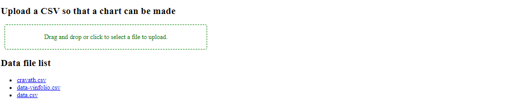
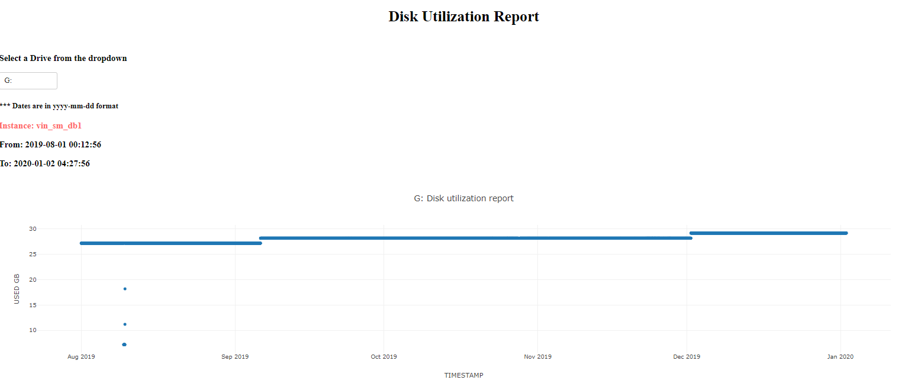
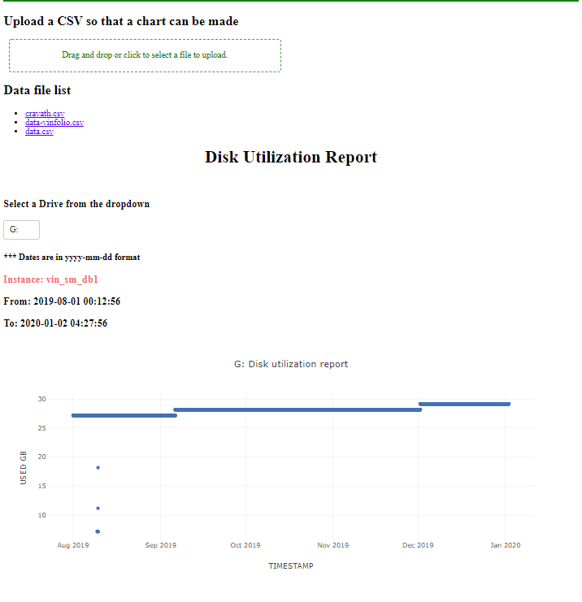

# Disk-Utilization-Dash
A web based dashboard that produces disk utilization reports once a CSV is uploaded. 

### Takes the input as a CSV file
Upload or find the CSV with the option. It will keep track of the uploads. 

### Creates a chart after selected drive in the dropdown. 
Has a drop down to select the disk to examine. 
Creates a line chart with that will illustrate the disk utilization usage. 

### It is a web app so all the work can be handled on a single page
This web app can also allow the user to drill down into the chart and select a time range with the cross hairs. This selection allows for a more granular view of the data usage. There are options to download a copy of the chart: the whole range or the part of the chart that has been selected by the cross hairs. 

